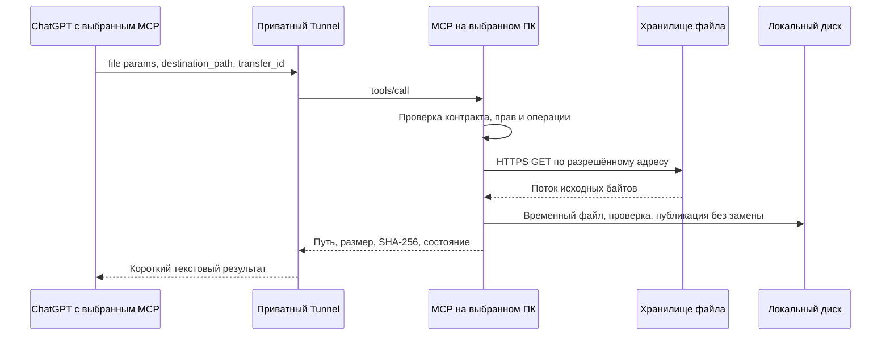

# План: передача файлов из ChatGPT на локальный компьютер

Статус: **только проектирование, функция не реализована и не установлена**. Дата исследования: 29 сентября 2026 года. База анализа: `72192dab6704a20ad32a44e78e249f9eb7169f64` в форке romanilyin/DesktopCommanderMCP.

## Цель и главный вывод

Добавить сохранение выбранного файла из чата на компьютер, к которому подключён приватный Desktop Commander. Основной сценарий — сохранить оригинал сгенерированной картинки в каталог проекта, сохранив размер, прозрачность и исходные байты. Второй сценарий — сохранить обычное вложение. Работа должна поддерживать несколько чатов и отдельные подключения к разным ПК.

Рекомендуемый путь: новый MCP-инструмент с файловым параметром ChatGPT. Локальный сервер получает временную ссылку, самостоятельно скачивает файл по HTTPS и пишет его на диск. Модель передаёт описание файла и назначения; бинарное содержимое не пересылается длинной строкой через её текстовый ответ.

**Первый обязательный этап будущей реализации — подтвердить передачу именно сгенерированных изображений в используемом ChatGPT через приватный Tunnel.** Наличие общего механизма file params ещё не доказывает доступность любого изображения из истории или другого чата. В рамках подготовки этого документа не выполнялись прототип, импорт, генерация, обновление инструментов или перезапуск MCP.

## Что подтверждено документацией, а что нужно проверить

OpenAI описывает файловые входы через `_meta["openai/fileParams"]`: список имён полей верхнего уровня; значение — файловый объект или массив. В объекте объявляются четыре строковых свойства: `download_url`, `file_id`, `mime_type`, `file_name`. Обязательны только первые два. Это важно проверить в итоговой JSON Schema после преобразования Zod, а не только в TypeScript. [Официальная спецификация файловых параметров](https://developers.openai.com/plugins/reference#file-apis).

Для необязательного интерфейса существуют `window.openai.uploadFile`, `selectFiles` и `getFileDownloadUrl`. Доступность API нужно определять по наличию функции; библиотека файлов доступна не всем. Этот вариант можно изучить отдельно, если прямой вызов не решит пользовательский сценарий. [Интерфейс плагина и расширения файлов](https://developers.openai.com/plugins/build/chatgpt-ui).

Secure MCP Tunnel передаёт MCP-запросы через исходящее подключение. Он позволяет сохранить сервер приватным без публичного входящего порта. Скачивание файла новым инструментом будет отдельным исходящим HTTPS-запросом самого локального сервера — это проектное решение, которое нужно проверить на реальной сети. [Документация Tunnel](https://developers.openai.com/api/docs/guides/secure-mcp-tunnels).

Матрица обязательной проверки:

| Источник | Что проверить в будущем | Если ChatGPT не передаёт файл |
| --- | --- | --- |
| Изображение, созданное в текущем чате | Появляются ли валидные файловые параметры; скачивается ли оригинал | Явно прикрепить/выбрать файл; не обещать автоматическое извлечение |
| Файл, загруженный пользователем | Схема, ссылка, разрешения и срок доступности | Повторно выбрать вложение и получить новую ссылку |
| Изображение из другого чата | Возможна ли передача в исходном чате с нужным подключением либо явный выбор в текущем | Переприкрепить файл; при доступной библиотеке исследовать выбор через неё |
| Ссылка вида sandbox:/… или путь /mnt/data/… | Не трактовать как путь на Windows или публичный HTTPS | Требовать доступный файловый объект, а не угадывать URL |
| Файл из ChatGPT Work или другой поверхности | Проверить тот же контракт независимо | Зафиксировать поддержку только реально прошедших вариантов |

Не предполагается API для чтения всех чужих/других чатов или всех картинок аккаунта. `file_id` здесь нельзя автоматически приравнивать к доступному объекту Files API проекта OpenAI Platform. Дополнительный Platform API key не предлагается как способ получить файлы из истории ChatGPT. Возможность использования конкретного файла должна подтвердиться передачей из ChatGPT и успешным скачиванием.

## Что уже есть в форке

| Участок | Факт из исходников | Следствие для плана |
| --- | --- | --- |
| [Схемы](../src/tools/schemas.ts), [обработчик записи](../src/handlers/filesystem-handlers.ts) | `write_file` принимает путь и строковый content | Нет отдельного контракта файлов ChatGPT |
| [ImageFileHandler](../src/utils/files/image.ts) | Строку он может декодировать как base64 и записать | Бинарная запись частично существует, но это не получение недоступного вложения из чата |
| [Файловые операции](../src/tools/filesystem.ts) | `readFileFromUrl` возвращает содержимое; загружает изображение целиком в память; таймер снимается после получения ответа, до дочитывания body | Не использовать этот путь как готовый безопасный потоковый импорт |
| [server.ts](../src/server.ts) | Определяет tools/list, маршрутизацию и вызовы журналирования | Добавить новый дескриптор, обработчик и обработку метаданных |
| [trackTools.ts](../src/utils/trackTools.ts), [toolHistory.ts](../src/utils/toolHistory.ts) | Аргументы сохраняются в журнал и историю вызовов | Перед передачей подписанных URL обязательно исключить их из записи |
| [Проверка путей](../src/tools/filesystem.ts) | Есть `validatePath`, allowedDirectories, разрешение родительских symlink | Переиспользовать политику доступа; отдельно проверить новые пути, junction и гонки |
| [Выбор UI](../src/utils/mcp-ui-ab-test.ts), [ограничитель ответа](../local/response-guard.mjs) | Есть текстовый режим и ограничение крупных ответов | Импорт возвращает короткий текст/JSON, без изображения или base64 в ответе |

Не расширять старый `write_file` до неоднозначного «строка или ссылка или файл». Отдельный инструмент будет иметь понятные права, контракт, ошибки и тесты. Исходные файлы в этой таблице только исследованы; данный коммит их не меняет.

## Предлагаемый контракт инструментов

Названия и пределы ниже — предложение для реализации, а не уже доступные инструменты.

### import_chat_file

Вход:

| Поле | Назначение |
| --- | --- |
| `file` | Обязательный файловый объект указанной выше схемы; `_meta["openai/fileParams"] = ["file"]` |
| `destination_path` | Обязательный абсолютный путь на выбранном ПК внутри разрешённых каталогов; родитель должен существовать |
| `transfer_id` | Обязательный идентификатор одной операции, сохраняемый при повторе или проверке результата |

Первый выпуск: один файл за вызов, PNG/JPEG/WebP, создание нового файла без перезаписи. Предлагаемые настраиваемые пределы: 25 MiB, общий таймаут 60 секунд, до двух скачиваний одновременно на ПК. Это собственные стартовые значения, а не лимиты OpenAI; уточнить после проверки фактического времени ответа Tunnel. Общие документы и архивы — следующий этап с сохранением непреобразованных байтов, без распаковки или исполнения.

Результат: `transfer_id`, `status` (`saved` / `already_saved`), идентификатор компьютера, итоговый абсолютный путь, число байтов, распознанный MIME и SHA-256. Размеры изображения можно добавить после ограниченной проверки метаданных. URL, содержимое файла и base64 в ответ не включать.

Аннотации: `readOnlyHint: false`; для варианта без перезаписи — `destructiveHint: false`; `openWorldHint: true`, поскольку есть внешнее скачивание. `idempotentHint: true` объявлять только после реализации и проверки устойчивой идемпотентности. Эти аннотации не заменяют проверку прав и не отменяют решения клиента о подтверждении действий.

### get_chat_file_transfer

Принимает только `transfer_id`; возвращает сохранённое состояние `in_progress`, `saved`, `failed`, `unknown` или `needs_verification`. Для последнего объясняет, что после аварии требуется проверка результата. Не принимает URL, не скачивает файл и не повторяет запись. Аннотации: чтение, без изменения данных и внешних запросов.

Этот инструмент нужен при потерянном ответе, 409/502 или повторной инициализации: сначала узнать состояние операции, а не автоматически снова выполнять запись. Если ошибка случилась ещё до доставки запроса, `unknown` не означает, что сервер видел файл.

## Как будет выполняться импорт

1. Проверить наличие разрешённых файловых параметров и связь `transfer_id` с выбранным компьютером, файлом и каноническим назначением. Не создавать каталоги проекта неявно.
2. Проверить URL и разрешённое назначение **до** сетевого запроса. Для скачивания не передавать runtime key Tunnel, cookies браузера или другие пользовательские секреты.
3. Скачать поток в уникальный временный файл рядом с назначением. Таймер и лимит байтов действуют до окончания body, а не только до получения заголовков.
4. Проверить тип по содержимому, фактический размер, соответствие допустимому расширению; считать SHA-256 поточно. Не перекодировать, не менять прозрачность, не снимать метаданные молча.
5. Опубликовать результат операцией, не заменяющей существующий файл, и сохранить итог операции. Существующий файл нельзя считать нашим только из-за совпадения имени.
6. Вернуть краткую квитанцию. После ошибки удалить только принадлежащий этой операции временный файл; не оставлять частичный файл под окончательным именем.

### Ограничения URL, путей и повторов

- Разрешать HTTPS и подтверждённые на этапе проверки хосты файлового хранилища. Не брать примерный CDN-домен из предположения; не открывать wildcard на весь интернет.
- Проверять каждый redirect, ограничить их число; отклонять URL с userinfo, локальные/частные/link-local адреса IPv4/IPv6, нестандартные схемы. Предотвратить DNS rebinding привязкой подключения к проверенным адресам с корректной TLS-проверкой. Прокси не должен обходить эти ограничения.
- Проверять реальный родительский каталог назначения и права непосредственно перед записью/публикацией; учесть Windows junction/symlink, ADS, UNC/device paths, зарезервированные имена и параллельные изменения. Серверные настройки доступа нельзя расширять аргументами импорта.
- Не доверять `file_name`, MIME и Content-Disposition как командам или разрешению на путь. Имя источника — только подсказка; место назначения задаёт отдельный проверенный параметр.
- Для 401/403 сообщать `SOURCE_UNAVAILABLE`: доступ отсутствует либо ссылка могла истечь. Не объявлять истечение доказанным по одному HTTP-коду. Запрашивать новый файловый параметр через клиент; не подставлять API key и не обходить отказ другим каналом.
- Временные URL могут обновляться между попытками. Идемпотентность привязать к `transfer_id`, исходному file_id и каноническому назначению, а не к полному URL. При другом файле/пути с прежним ID — явная ошибка конфликта.
- Устойчивый локальный журнал операции и блокировка назначения должны переживать перезапуск MCP. При аварии между записью и фиксацией статуса сверять назначение с сохранённой квитанцией/хешем; при недостаточных данных возвращать `needs_verification`. Одна память процесса недостаточна.

### Журналы и диагностика

До первого реального файлового вызова добавить очистку аргументов для `trackToolCall` и `toolHistory.addCall`, включая отклонённые/невалидные запросы, исключения и отладочный вывод. Это отдельное условие допуска: нынешнее журналирование может сохранить действующую подписанную ссылку. Проверить также ошибки HTTP-клиента, историю, возвращаемую инструментом, и транспортные диагностические логи; не обещать, что сервер управляет журналами самого ChatGPT.

В журнале импорта достаточно ID операции, времени, этапа, числа байтов, кода результата, длительности и HTTP-статуса без URL. Не сохранять query-параметры, токены, тело файла, raw file_id и полный путь в общую телеметрию. Локальная квитанция для проверки результата может содержать путь/хеш с правами текущего пользователя. Задать ограничение объёма, срок хранения и правила очистки; URL держать только в памяти текущего запроса.

Отличать: запрос не дошёл; запрет источника; DNS/TLS/сеть; лимит размера; отмена; отказ диска; конфликт назначения; файл сохранён, но ответ потерян. Пассивному монитору оставить сбор очищенных событий, без пробных скачиваний и автоматического повтора импорта.

## Работа с несколькими чатами и компьютерами

Каждый ПК сохраняет свой плагин и Tunnel ID. Назначение выбирается подключением, а не текстом «на домашний ПК» внутри аргументов. В квитанции явно указывать, какой сервер и путь использованы; не переключаться на другой доступный MCP при сбое.

Для картинки из другого чата сначала предпочтителен вызов нужного MCP в исходном чате. Если это невозможно, пользователь явно выбирает/прикрепляет файл в чате назначения. Наличие файла в библиотеке и возможность передать его плагину нужно проверить отдельно; ссылка на страницу беседы сама по себе не заменяет файловый параметр.

Два чата, пишущие в один путь, должны получить один сохранённый файл и явный конфликт/состояние операции, без частичного перемешивания содержимого. Повтор с тем же `transfer_id` возвращает результат без второго скачивания. Другой ID не разрешает перезапись.

Текущий текстовый режим сохранить. Файловую метку `openai/fileParams` не удалять вместе с HTML-метаданными при `mcpUiPreviewsEnabled: false`. Собственная карточка не нужна для основного варианта; её нельзя включать глобально ради передачи файлов. Если потребуется picker, предложить отдельный опциональный интерфейс после проверки прямого пути.

## Этапы реализации после отдельной команды пользователя

### A. Проверка совместимости — условие продолжения

В отдельном тестовом экземпляре/подключении объявить минимальный инструмент файлового входа с заранее очищаемой диагностикой. Проверить загруженный PNG и изображение, только что созданное в ChatGPT: какие поля поступают, получаются ли исходные байты, доступны ли ссылки из сети целевого ПК, сохраняются ли метаданные через tools/list и Tunnel. Записывать только признаки наличия полей, типы, размер и хеш; не журналировать ссылку.

Результат — таблица реально поддержанных сценариев/поверхностей и хостов скачивания. Если сгенерированные изображения не передаются, остановить обещание «сохранить прямо из генерации» и зафиксировать рабочий вариант с явным выбором файла. Не начинать сложный downloader, пока не подтверждён источник байтов.

### B. Контракт, очистка журналов и политика файлов

Добавить схемы, отдельные дескрипторы и обработчики, очистку журналов, серверные ограничения и тесты конечной JSON Schema. Проверить аннотации, клиентскую фильтрацию инструментов и сохранность file params в текстовом режиме.

### C. Потоковое сохранение и восстановление состояния

Реализовать сетевые проверки, лимиты, временные файлы, публикацию без перезаписи, устойчивые квитанции, блокировки и инструмент статуса. Обработка 409/502 и аварий должна оставлять проверяемый результат, не вызывать повторную запись автоматически.

### D. Проверки и выпуск

Провести изолированные тесты, затем сквозную проверку через тестовое приватное подключение. После одобрения установить сначала на один ПК; обновить discovery инструментов в ChatGPT и проверить существующие чтение/запись/процессы. Второй ПК обновлять отдельно. Для отката выключить новые инструменты/вернуть предыдущий релиз, сохранив уже импортированные файлы и квитанции.

### Предполагаемые файлы изменений

| Файлы | Будущая работа |
| --- | --- |
| `src/tools/schemas.ts`, `src/server.ts`, `src/handlers/index.ts` | Схемы, дескрипторы, маршрутизация |
| Новые `src/handlers/chat-file-handlers.ts`, `src/tools/chat-file-import.ts` | Импорт и статус операции |
| Новые утилиты скачивания/квитанций; `src/tools/filesystem.ts` | Поток байтов, границы путей, блокировки |
| `src/utils/trackTools.ts`, `src/utils/toolHistory.ts` | Очистка чувствительных аргументов до записи |
| `src/config-manager.ts`, `src/types.ts` | Лимиты/настройки, если нужны новые поля |
| `mcpb-bundle/manifest.json`, `scripts/validate-tools-sync.js` и фильтр инструментов | Согласованность опубликованного набора; проверить необходимость изменений |
| Новые тесты, `local/compatibility-test.mjs`, `local/test/ui-text-mode.test.mjs` | Импорт, совместимость и сохранение текстового режима |
| Документация установки и наблюдения | Пользовательские сценарии, коды ошибок, диагностика, обновление |

Зависимости пока не добавлять. При реализации сначала оценить Node HTTPS/streams/crypto, существующие file-type и proper-lockfile; если для сетевой политики или надёжной публикации на Windows нужен иной механизм, обосновать и протестировать его отдельно.

## Критерии приёмки

1. Сгенерированное PNG с прозрачностью сохраняется по команде в выбранном чате на выбранном ПК: байты и SHA-256 совпадают с скачанным оригиналом. Если прямой путь недоступен, документируется и проверяется явное прикрепление/выбор; тест загруженного PNG не выдаётся за тест генерации.
2. Импорт возвращает проверяемый путь, размер и SHA-256 без больших карточек, base64 и подписанной ссылки.
3. PNG/JPEG/WebP сохраняются без перекодирования. HTML-страница ошибки с кодом 200, подмена типа, усечённое тело и превышение лимита не становятся «успешной картинкой».
4. Отсутствующее имя/MIME допустимы по схеме; истёкший/недоступный источник, отсутствие места, отказ прав, timeout и отмена дают понятный код, не портят существующие файлы.
5. Повтор после потери ответа, параллельные вызовы из двух чатов и авария на каждом этапе не приводят к замене или двойной записи. Проверка статуса не скачивает файл.
6. SSRF, redirect в локальную сеть, DNS rebinding, traversal, symlink/junction и Windows ADS проверяются изолированными фикстурами, без обращений к чужим адресам.
7. Тесты с искусственными секретными маркерами подтверждают отсутствие URL/token/file payload в логах, истории, ошибках и телеметрии, в том числе при невалидном входе.
8. Работают исходные чтение, запись, запуск процессов и настройки UI. Тесты выполняются без перезапуска рабочего подключения до согласованного выпуска.
9. Отдельно проверен второй ПК и отсутствие записи на первом при выборе второго. Пока этот тест не проведён, поддержка двух установок не считается подтверждённой.

## Что нужно решить до реализации

- Подтверждает ли этап A передачу файлов именно из генерации в используемом ChatGPT.
- Достаточно ли первой версии для PNG/JPEG/WebP или одновременно нужны другие форматы.
- Какие каталоги будут разрешены для импорта на каждом ПК, без расширения существующих прав по умолчанию.
- Подходят ли стартовые пределы 25 MiB / 60 секунд; при больших файлах потребуется отдельная асинхронная схема и отмена, а не бесконечное увеличение таймаута.
- Нужен ли опциональный выбор через библиотеку, если прямой путь недоступен. Сейчас он не реализуется и карточки не включаются.

Оценка объёма: сначала небольшой эксперимент совместимости; затем отдельные изменения для журналирования, потокового импорта/квитанций и тестов. Оценку сроков фиксировать после этапа A: основная неопределённость — выдача файла клиентом, а не возможность Node записать байты.
