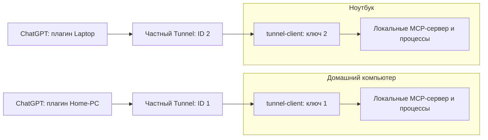

# Desktop Commander на Windows через отдельный Secure MCP Tunnel

Это руководство устанавливает публичный форк `romanilyin/DesktopCommanderMCP` как локальный MCP-сервер и подключает его к ChatGPT через частный OpenAI Secure MCP Tunnel. Настройте каждый компьютер отдельно: например, чат «Домашний ПК» подключается к домашнему компьютеру, а чат «Ноутбук» — к ноутбуку. Компьютер с сервером должен быть включён, пользователь Windows должен войти в систему, а сеть должна быть доступна.

Ветка `main` основана на Desktop Commander `0.2.51`. Установщик закрепляет Node.js `24.21.0` и tunnel-client `0.0.15`, устанавливает npm-зависимости и собирает проект локально. Первый компьютер в этой конфигурации проверен с 26 доступными инструментами. На другом чистом ПК завершите проверки в разделе «Проверка».

## Как устроено подключение



Для каждого ПК создайте собственный туннель в OpenAI Platform и сохраните собственный runtime key. Не переносите между компьютерами Tunnel ID, runtime key, `.local` или DPAPI-зашифрованные файлы состояния. Можно копировать только исходный код и повторять установку.

## 1. Подготовьте Windows

Поддерживаются Windows 10/11 x64, PowerShell 7, Git и доступ в интернет. Откройте PowerShell 7 (не Windows PowerShell 5.1) под тем же Windows-пользователем, который будет ежедневно использовать компьютер.

Установите недостающие инструменты официальным пакетом Windows Package Manager:

```powershell
winget install --id Git.Git --exact
winget install --id Microsoft.PowerShell --exact
```

Либо скачайте установщики у поставщиков: [Git for Windows](https://git-scm.com/download/win) и [PowerShell](https://github.com/PowerShell/PowerShell/releases). Закройте и снова откройте PowerShell 7, затем проверьте:

```powershell
$PSVersionTable.PSVersion
git --version
```

Установщик репозитория сам загружает закреплённые Node.js `24.21.0` и tunnel-client `0.0.15` для Windows x64. Он сверяет SHA-256 архивов с официальными файлами контрольных сумм, распаковывает их в `.local/runtime`, затем устанавливает npm-зависимости и собирает проект. Node не требуется в `PATH`; не устанавливайте глобальный Node специально для проекта.

## 2. Убедитесь, что команды выполняются на нужном ПК

Перед установкой и перед любым локальным изменением проверьте имя компьютера, пользователя, PowerShell и каталог. Это полезно, если вы управляете машиной через удалённый терминал:

```powershell
hostname
$env:COMPUTERNAME
[System.Security.Principal.WindowsIdentity]::GetCurrent().Name
$PSVersionTable.PSVersion
Get-Location
```

Сопоставляйте результат с физическим компьютером. Имя, которое отображается у ChatGPT-плагина, задаётся вами и само по себе не подтверждает, к какому ПК подключён туннель.

## 3. Создайте отдельный Tunnel в OpenAI Platform

Войдите в [OpenAI Platform](https://platform.openai.com/) под тем же аккаунтом ChatGPT, который будет использовать плагин. Выберите личную организацию и ChatGPT workspace, затем откройте раздел Secure MCP Tunnels и создайте private tunnel для этого ПК. Точные названия разделов могут меняться; актуальная документация OpenAI: [Secure MCP Tunnels](https://developers.openai.com/api/docs/guides/secure-mcp-tunnels).

Сохраните Tunnel ID вида `tunnel_<32 шестнадцатеричных символа>`. Runtime-ключу для запуска нужны права **Tunnels: Read** и **Tunnels: Use**; создание и управление туннелями требует **Tunnels: Manage**. Проверьте экран выдачи ключа в Platform: фактический охват прав определяется настройкой ключа и аккаунта, поэтому не исходите из предположения, что ключ автоматически ограничен одним выбранным туннелем. Для компьютеров выпустите разные runtime keys и храните их как секреты.

Не вставляйте ключ в чат, командную строку, Git, тикеты или скриншоты. Не передавайте его второй машине. Настройка ChatGPT должна ссылаться на приватный Tunnel ID: при подключении этого частного туннеля дополнительная MCP-аутентификация не требуется. Не публикуйте туннель как общедоступный endpoint.

## 4. Скачайте форк и установите локальный сервер

Из каталога, в котором вы храните исходный код, выполните:

```powershell
git clone https://github.com/romanilyin/DesktopCommanderMCP.git
cd DesktopCommanderMCP
git switch main
```

Если вы уже клонировали форк, перейдите в его каталог и проверьте ветку:

```powershell
git status --short --branch
```

Установите проект. Подставьте Tunnel ID, созданный именно для этого компьютера:

```powershell
./local/windows/Install.ps1 -TunnelId 'tunnel_0123456789abcdef0123456789abcdef' -Name 'Desktop Commander - Home-PC' -Alias home
```

Для ноутбука используйте его собственный Tunnel ID, например имя `Desktop Commander - Laptop` и alias `laptop`. Не повторяйте команды с примерным ID выше. Установка создаёт локальные конфигурацию и runtime-файлы в `.local`; они не должны попадать в Git.

## 5. Сохраните runtime key этого туннеля

Рекомендуемый способ — скрытый ввод ключа в терминале. PowerShell попросит секрет и сохранит его с шифрованием Windows DPAPI для текущего пользователя и компьютера:

```powershell
./local/windows/Save-Key.ps1
```

Вставьте runtime key только в защищённый prompt. Не используйте параметр командной строки для ключа и не перенаправляйте ввод в файл. DPAPI-файл можно расшифровать только в контексте соответствующего Windows-пользователя на этой машине. Если переустанавливаете Windows, меняете пользователя или переносите проект на другой компьютер, выпустите новый runtime key и сохраните его заново.

Есть альтернативный одноразовый локальный ввод через браузер:

```powershell
./local/windows/Save-Key.ps1 -Browser
```

Откройте напечатанный URL в обычном браузере на этом компьютере и введите ключ в локальную форму. Если форма вернула HTTP 403, обновите именно корневой адрес формы, указанный скриптом, и повторите ввод. Не отключайте CSP, проверку CSRF или брандмауэр.

## 6. Запустите туннель и проверьте состояние

Сначала создайте tunnel-client profile командой `Connect`, затем запустите `Doctor` и `Status`:

```powershell
./local/windows/Tunnel.ps1 -Action Connect
./local/windows/Tunnel.ps1 -Action Doctor
./local/windows/Tunnel.ps1 -Action Status
```

`Doctor` использует профиль, созданный при первом успешном `Connect`; до этого он может завершиться ошибкой отсутствующего профиля. `Connect` поднимает локальный MCP-сервер и соединение tunnel-client с выделенным туннелем. `Status` показывает состояние подключения. При диагностике не публикуйте ключи или содержимое `.local`.

Проверьте затем сессию ChatGPT по шагам ниже. Когда закончите работу на время, сервер можно остановить:

```powershell
./local/windows/Tunnel.ps1 -Action Stop
```

## 7. Подключите туннель в ChatGPT

Включите Developer Mode в настройках ChatGPT: **Settings → Security → Developer mode** (названия и расположение пунктов могут отличаться). В меню **Settings → Apps/Plugins** добавьте MCP-подключение через Tunnel и укажите Tunnel ID этого компьютера. Дайте подключению понятное имя, которое помогает выбрать машину в нужном чате: `Desktop Commander — Home-PC` или `Desktop Commander — Laptop`.

Используйте тот же аккаунт и ChatGPT workspace, которые были выбраны при создании туннеля. Для private tunnel не добавляйте отдельную MCP-аутентификацию. Выдавайте разрешения инструментам с учётом того, какие действия вы готовы разрешить. Полный доступ не является обязательным условием подключения и не гарантирует обход встроенных ограничений или подтверждений.

Начните новый чат, явно выберите соответствующее подключение через `@`/меню инструментов и попросите выполнить безвредное чтение, например определить текущую папку. Повторите в другом чате с плагином второго ПК и убедитесь, что ответ относится к ожидаемому компьютеру.

## 8. Автозапуск (по желанию)

Сначала добейтесь успешного ручного `Connect` и `Status`. Затем установите задачу автозапуска для текущего Windows-пользователя:

```powershell
./local/windows/Install-Autostart.ps1
```

Задача запускает туннель при следующем входе пользователя в Windows и не включает watchdog для восстановления после последующего падения процесса. Автозапуск не превращает выключенный компьютер в удалённый сервис. Для отключения:

```powershell
./local/windows/Remove-Autostart.ps1
```

Учитывайте, что фоновый tunnel-client и ChatGPT/tunnel имеют собственные лимиты и квоты. Это не подписка на отдельный хостинговый сервис: обработка инструментов выполняется на вашем ПК. Открывать входящий порт в роутере или публичный порт Windows Firewall не нужно.

## 9. Проверка после установки

В корне клона выполните тесты скриптов:

```powershell
$cfg = Get-Content ./.local/config.json -Raw | ConvertFrom-Json
& $cfg.nodePath --test local/test/*.test.mjs
```

Для сквозной проверки конфигурации используйте Node из `.local/runtime`, путь к которому записан в локальной конфигурации, и тестовый сценарий:

```powershell
& $cfg.nodePath ./local/smoke-test.mjs
```

Smoke test использует временные файлы. Перед запуском на рабочей машине всё равно проверьте его команды и место создания временных данных. После тестов подтвердите в ChatGPT наличие инструментов и выполните безопасный запрос чтения. Настройка на первом ПК была проверена с 26 инструментами; чистый второй ПК должен пройти собственную проверку. Число и набор инструментов могут измениться с обновлениями.

## Обычная работа с несколькими компьютерами

Сначала убедитесь, что оба целевых ПК включены, пользователь вошёл в Windows и соответствующий `Tunnel.ps1 -Action Status` показывает соединение. В каждом чате выберите только плагин нужного ПК:

```text
@Desktop Commander — Home-PC перечисли файлы в моей тестовой папке.
@Desktop Commander — Laptop покажи текущую папку на ноутбуке.
```

Плагин и частный туннель задают целевой компьютер. Не выбирайте плагин одного ПК, ожидая, что он выполнится на другом. Один stdio MCP child обслуживает инструменты в пределах своей MCP-сессии. Несколько клонов на одном Windows-пользователе всё ещё могут разделять пользовательскую конфигурацию в `%USERPROFILE%\.claude-server-commander` и журналы; отдельный клон с собственным туннелем не означает полной изоляции состояния. Текущая конфигурация поддерживает отдельные ПК с отдельными туннелями и плагинами; она не реализует gateway-изоляцию нескольких независимых рабочих пространств на одном хосте.

Для такого сценария будущая архитектура должна маршрутизировать каждый вызов явно по host и workspace, иметь отдельный процесс на сессию или эквивалентную изоляцию, очередь задач для каждого workspace, поддержку длительных jobs и передачу результатов через artifacts. Она также должна избегать глобального «активного проекта». Это направление развития, а не возможность текущего релиза.

## Обновление

Сначала проверьте, что вы в правильном клоне и ветке. Не обновляйте во время выполняющейся команды; дождитесь завершения активных процессов.

```powershell
hostname
$env:COMPUTERNAME
Get-Location
git status --short --branch
./local/windows/Tunnel.ps1 -Action Stop
git pull --ff-only
./local/windows/Build.ps1
```

Затем снова запустите соединение:

```powershell
./local/windows/Tunnel.ps1 -Action Connect
./local/windows/Tunnel.ps1 -Action Status
```

Если обновление меняет список или схемы инструментов, обновите подключение/список инструментов в ChatGPT и начните новый чат, выбрав нужный плагин. Для собственных инструментов редактируйте исходники `src/server.ts`, `src/tools/schemas.ts` и `src/tools/`, затем соберите проект. Публикация в npm не нужна; имя upstream-пакета можно оставить прежним.

## Безопасность, резервирование и удаление

- Не добавляйте runtime key, `.local/config.json`, `.local/runtime`, `.local/state` и логи в коммиты или архивы. Проверьте `git status --short` перед публикацией изменений.
- Исходники можно клонировать на другой ПК; секреты и DPAPI-состояние нужно создать заново на нём.
- Не открывайте сетевой входящий порт ради туннеля. Исходящее соединение инициирует tunnel-client.
- Разрешения ChatGPT задавайте осознанно. Проверяйте конкретный инструмент и подтверждайте действия, которые могут менять файлы или запускать команды.
- При потере ключа отзовите его в Platform и выпустите новый с правами Read и Use для правильного туннеля.

## Неисправности

| Симптом | Что проверить |
|---|---|
| Tunnel не соединяется | Выполните `Status`; если профиль ещё не создан, сначала запустите `Connect`, затем `Doctor`. Проверьте интернет, Tunnel ID, права runtime key `Tunnels: Read` и `Tunnels: Use`, правильную организацию и workspace. Не выдавайте runtime-ключу Manage без необходимости. |
| ChatGPT показывает другой компьютер | Сверьте `hostname`, `$env:COMPUTERNAME` и alias локально; в чате выберите плагин, привязанный к Tunnel ID именно этого ПК. Отображаемое имя плагина не является проверкой хоста. |
| `mcp_initialization_required` | Это ошибка handshake/инициализации MCP, а не сообщение о недостающих разрешениях. Перезапустите локальный tunnel/server и переподключите инструмент в новом чате. |
| Форма ввода ключа отвечает 403 | Обновите корневую страницу одноразовой локальной формы и повторите. Не используйте путь `/save` как страницу формы и не отключайте защиту браузера. Либо используйте безопасный ввод в терминале. |
| Вызов оборвался с HTTP 413 или очень большим ответом | HTTP 413 возникал для ответов больше 10 MiB. Локальный guard ограничивает ответы SDK stdio до отправки через транспорт и добавляет в текст результата предупреждение с частичным preview. Он сохраняет исходное значение `isError` (оно может быть `true` или `false`); ограничение не означает, что команда не выполнилась. Не повторяйте мутацию ради вывода: проверьте файл или процесс и запросите меньший диапазон либо более узкий результат. |
| После перезапуска остался процесс | До запуска новой команды проверьте локальные процессы и MCP-сессии (`list_processes` / `list_sessions`) и остановите только подтверждённо лишний процесс. Не запускайте заново потенциально изменяющую систему команду, пока не выяснили результат первой. |
| Ключ не читается после переноса/смены профиля | DPAPI привязан к исходному Windows-пользователю и компьютеру. Выпустите новый runtime key и сохраните его заново на целевом ПК. |
| В ChatGPT нет новых инструментов | Убедитесь, что локальные build и tunnel подключены, обновите подключение/инструменты в ChatGPT и откройте новый чат с выбранным плагином. |

Официальные справки: [OpenAI Secure MCP Tunnels](https://developers.openai.com/api/docs/guides/secure-mcp-tunnels), [подключение ChatGPT к MCP](https://developers.openai.com/plugins/deploy/connect-chatgpt), [формат конфигурации tunnel-client 0.0.15](https://github.com/openai/tunnel-client/blob/v0.0.15/docs/configuration.md).
